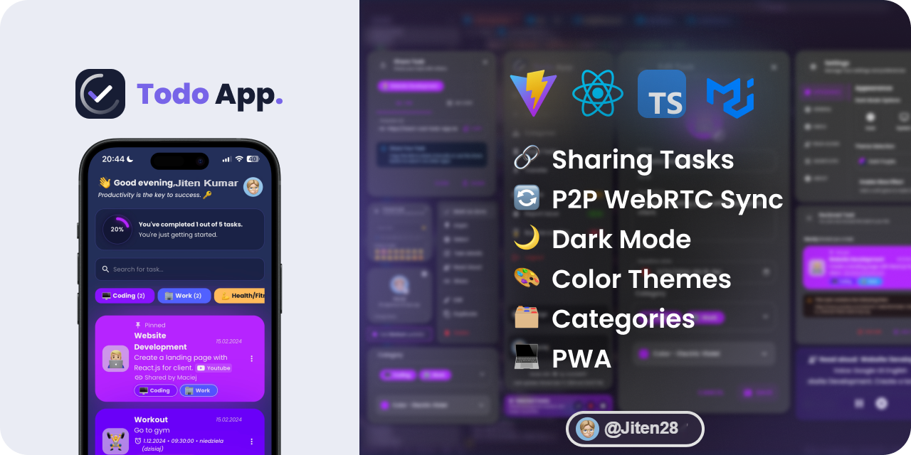
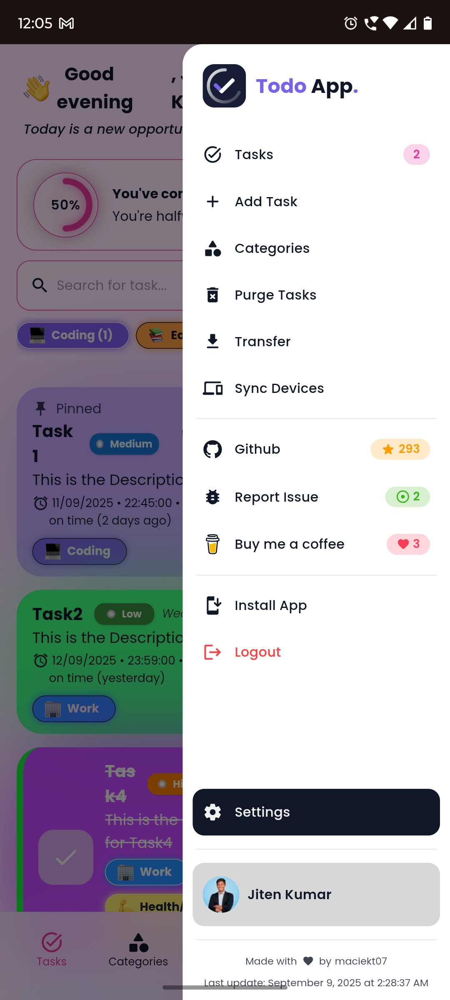
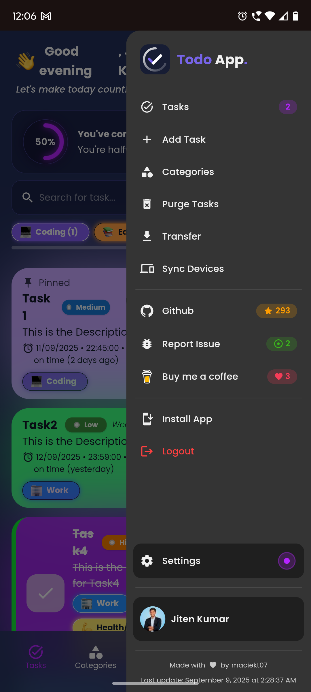
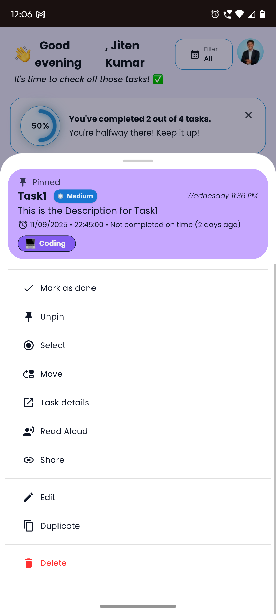
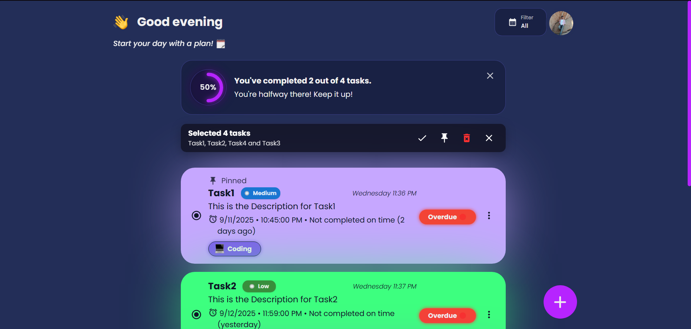

<!-- <p align="center">

</p> -->

# 📝 React.js Todo App (Enhanced)

<p align="center"><i>A fast and modern Todo app built with React, featuring task sharing via link, P2P Task Sync with WebRTC, theme customization, offline usage as a PWA, and caching for smooth performance.</i></p>



## 🌐 Live Demo  
👉 [https://todo-enhancement.netlify.app](https://todo-enhancement.netlify.app)

[](https://app.netlify.com/sites/todo-enhancement/deploys)  
  
  
  

---

## 💻 Tech Stack

<ul style="display: flex; flex-direction: column; gap:10px;">
  <li> React</li>
  <li> TypeScript</li>
  <li> Vite</li>
  <li> Vitest</li>
  <li> Emotion</li>
  <li> Material UI (MUI)</li>
</ul>

---

## ⚡ Features

- 🔗 **Share Tasks** by Link or QR Code  
- 🎨 **Custom Themes & Dark Mode**  
- 🗣️ **Task Reading Aloud** (SpeechSynthesis API)  
- 📥 **Import / Export Tasks** via JSON  
- 📴 **Progressive Web App (PWA)** – installable & offline-ready  
- 🔄 **Update Prompt** for new versions  
- 📱 **Custom Splash Screens** for mobile  

---

## 👨‍💻 Installation

```bash
# Clone the repository
git clone https://github.com/Jiten28/todo-enhancement-jiten.git

# Navigate to project folder
cd todo-enhancement-jiten

# Install dependencies
npm install

# Start development server
npm run dev
```

Runs at [http://localhost:5173/](http://localhost:5173/).

> 💡 For mobile testing:  
> Use `npm run dev:host` to preview over local network (with HTTPS & QR code for quick access).

---

## 📦 Build

```bash
npm run build
```

Generates optimized PWA build inside `/dist`.

---

## 📷 Screenshots

*(Update with your own screenshots later)*

  
  
  
  

---

## 🚀 Performance


---

## 👤 Author

**Jiten Kumar**

* 🌐 Portfolio: [jitenkumarportfolio.netlify.app](https://jitenkumarportfolio.netlify.app)  
* 💻 GitHub: [Jiten28](https://github.com/Jiten28/todo-enhancement-jiten)  
* 💼 LinkedIn: [Jiten Kumar](https://www.linkedin.com/in/jiten-kumar-85a03217a)  
* ☕ Support: [Buy Me a Coffee](https://buymeacoffee.com/jiten282005)  

> Passionate about building modern web apps with React, TypeScript, and PWA features.

---

## 📜 License

licensed under [MIT](https://github.com/maciekt07/TodoApp/blob/main/LICENSE).
